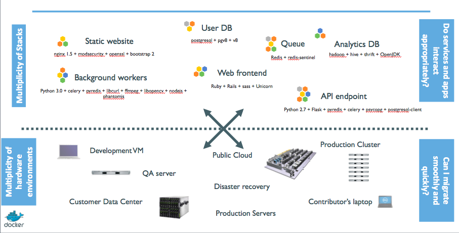

background-image: url(images/docker_logo_old_02.png)
background-size: 90% 
background-position: center
---

class: center, middle
# Section 2 - Introduction to Docker

---

## Docker concepts (What is Docker, Images and containers)

 - Docker is a platform to develop, deploy, and run applications with containers. The use of Linux containers to deploy applications is called containerization. Containers are not new, but their use for easily deploying applications is.
 - A container is created by running a Docker image. An image is an executable package that includes everything needed to run an application--the code, a runtime, libraries, environment variables, and configuration files.

---

## Virtual machines vs Docker containers

---

## The deployment problem 

---

## The deployment solution 

---

## Docker engine types (Linux Container vs Windows Container)
 - There are two types of Docker containers, Linux Container and Windows container.
 - It vital to understand that a running container shares the kernel of the host machine that is running on. This means that Linux containers requires Linux host and Windows containers requires Windows host
 - What about 
    - Docker for Windows / Docker toolbox 
    - Docker for MAC
   
 - Windows containers are very new. Only on late 2016 Microsoft announce native support for windows containers    
